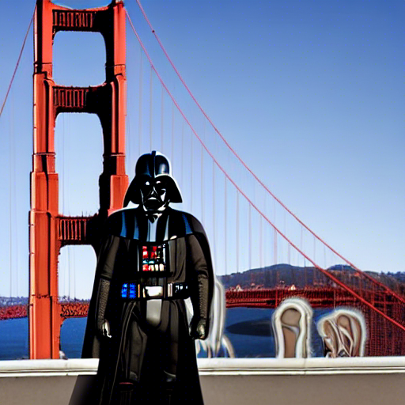

Stable Diffusion v1.5 setup on a Radeon Pro VII (AMD GPU)
=========================================================

These are personal notes cataloging steps I needed to do to get [Stable Diffusion v1.5](https://huggingface.co/runwayml/stable-diffusion-v1-5) running locally on my Radeon Pro VII (AMD GPU).
I started from Ubuntu v18.04, Linux kernel version `Linux 5.4.0-131-generic`, no ROCm installed, and no previous version of Stable Diffusion or corresponding Python environment.
These notes cover roughly 4 steps:
  * [Upgrade Ubuntu](#upgrade-ubuntu) (to ROCm-supported version)
  * [Upgrade Linux kernel](#upgrade-linux-kernel) (for compatibility with the AMD GPU)
  * [Install ROCm](#install-rocm)
  * [Download Stable Diffusion and set up Python environment](#download-stable-diffusion-and-set-up-python-environment)
  
After these are a few sections covering miscellaneous tips, comparisons of images generated using different model weights, and miscellaneous issues encountered during the setup:
  * [Stable Diffusion tips](#stable-diffusion-tips)
  * [Image comparisons](#image-comparisons)
    * [EMA-only vs. EMA & non-EMA weights](#ema-only-vs-ema--non-ema-weights)
    * [Stable Diffusion v1.4 vs. v1.5](#stable-diffusion-v14-vs-v15)
  * [Issues encountered](#issues-encountered)

Contents of this repository are as follows:
  * [README.md](README.md): guide of steps I needed to do to set up and run Stable Diffusion locally on Radeon Pro VII (an AMD GPU).
  * [requirements.txt](requirements.txt): Python environment that worked for me to run Stable Diffusion on Radeon Pro VII.


Upgrade Ubuntu
--------------

I started from Ubuntu v18.04, so needed to first upgrade Ubuntu to a [ROCm-supported version](https://docs.amd.com/bundle/ROCm-Installation-Guide-v5.3/page/How_to_Install_ROCm.html#:~:text=Downloading%20and%20Installing%20the%20Installer%20Script%20on%20Ubuntu), prior to installing ROCm.
I ran these commands to do a full update of my system:
```bash
$ sudo apt update
$ sudo apt upgrade
$ sudo apt dist-upgrade
```

and removed unneeded packages:
```
$ sudo apt autoremove
```

which allowed to upgrade from Ubuntu v18.04 to a ROCm-supported version (v20.04 or v22.04), with the following:
```bash
$ sudo do-release-upgrade -f DistUpgradeViewGtk3
```

This downloads an upgrade release tool, I followed the prompts from the GUI installer.


Upgrade Linux kernel
--------------------

Different AMD GPUs may require a different Linux kernel than what is installed on your system.
E.g., if ROCm is installed and you run `rocminfo` with an incompatible Linux kernel version, you can get an error such as:
```
HSA Error:  Incompatible kernel and userspace, AMD Radeon (TM) Pro VII disabled. Upgrade amdgpu.
```

This suggests that the Linux kernel should be upgraded.
In my case, I had Linux kernel version `Linux 5.4.0-131-generic`, which was incompatible with my Radeon Pro VII GPU.
So I upgraded my Linux kernel to something compatible with my GPU.
First I downloaded [this Bash script](https://github.com/pimlie/ubuntu-mainline-kernel.sh) for Linux kernel installation:
```bash
$ wget https://raw.githubusercontent.com/pimlie/ubuntu-mainline-kernel.sh/master/ubuntu-mainline-kernel.sh
```

I also needed to add executable permissions for the script:
```bash
$ chmod go+x ubuntu-mainline-kernel.sh
```

I moved the Linux kernel bash script to `/usr/local/bin/`:
```bash
$ sudo mv ubuntu-mainline-kernel.sh /usr/local/bin/
```

The Linux kernel version is updated by running the script:
```bash
$ sudo ubuntu-mainline-kernel.sh –i
```

I rebooted, then verified the Linux kernel version:
```bash
$ uname -r
6.0.3-060003-generic
```

Now I had a Linux kernel installed for my Ubuntu v20.04 that is compatible with Radeon Pro VII.


Install ROCm
------------

From here I followed [official instructions for ROCm v5.3 installation](https://docs.amd.com/bundle/ROCm-Installation-Guide-v5.3/page/How_to_Install_ROCm.html).
There are various options for installation method; I opted for the '[Installer Script Method](https://docs.amd.com/bundle/ROCm-Installation-Guide-v5.3/page/How_to_Install_ROCm.html#:~:text=Installation%20Guide.-,Installer%20Script%20Method,-The%20installer%20script).'
Furthermore, there are instructions for different versions of Ubuntu; I followed the [instructions for the version I had installed](https://docs.amd.com/bundle/ROCm-Installation-Guide-v5.3/page/How_to_Install_ROCm.html#:~:text=Downloading%20and%20Installing%20the%20Installer%20Script%20on%20Ubuntu), Ubuntu v20.04:
```bash
$ sudo apt-get update
$ wget https://repo.radeon.com/amdgpu-install/5.3/ubuntu/focal/amdgpu-install_5.3.50300-1_all.deb 
$ sudo apt-get install ./amdgpu-install_5.3.50300-1_all.deb
```

This allows to use the `amdgpu-install` tool.
One can make an appropriate selection, reading information from:
```bash
$ sudo amdgpu-install --list-usecase
```

The following selection was appropriate for my use case (though it's not the minimal requirement to run Stable Diffusion):
```bash
$ sudo amdgpu-install --usecase=dkms,graphics,rocm,rocmdevtools,hip,hiplibsdk,mllib,mlsdk
```

This completed ROCm installation.
As a check, I ran `rocminfo`, and could see information about my system, including the CPU and GPU:
```
==========               
HSA Agents               
==========               
*******                  
Agent 1                  
*******                  
  Name:                    AMD Ryzen Threadripper 3960X 24-Core Processor
  Uuid:                    CPU-XX                             
  Marketing Name:          AMD Ryzen Threadripper 3960X 24-Core Processor
  Vendor Name:             CPU

⋮

*******                  
Agent 2                  
*******                  
  Name:                    gfx906
  Uuid:                    GPU-a784386172dc76bd  
  Marketing Name:          AMD Radeon (TM) Pro VII            
  Vendor Name:             AMD
```

As another check, I ran `rocminfo`, which shows some information about the GPU:
```
======================= ROCm System Management Interface =======================
================================= Concise Info =================================
GPU  Temp   AvgPwr  SCLK    MCLK    Fan    Perf  PwrCap  VRAM%  GPU%  
0    49.0c  25.0W   860Mhz  350Mhz  9.41%  auto  190.0W    2%   0%    
================================================================================
============================= End of ROCm SMI Log ==============================
```


Download Stable Diffusion and set up Python environment
------------------------------------------------------

With a compatible Ubuntu, Linux kernel, and ROCm installed, I was ready to get Stable Diffusion set up.
I wanted to run Stable Diffusion locally on my GPU, and chose to use [Conda](https://anaconda.org/anaconda/python) (via [Miniconda](https://docs.conda.io/en/latest/miniconda.html)) for setting up the Python environment.
I installed Miniconda with the following commands, selecting `yes` when prompted about whether to initialize Conda:
```bash
$ wget https://repo.anaconda.com/miniconda/Miniconda3-4.7.12-Linux-x86_64.sh
$ sh Miniconda3-4.7.12-Linux-x86_64.sh
```

Clicking `Enter` gets through to the end of the installation.
There are more recent versions of Miniconda, but with those I could get an error during downloads when trying to set up a new Conda environment:
```bash
CondaHTTPError: HTTP 000 CONNECTION FAILED
```
and so I stuck with Miniconda v4.7.12.
With Miniconda installed, I closed the terminal window and opened a new one.

From here I cloned the [Stable Diffusion repository](https://github.com/runwayml/stable-diffusion):
```bash
$ git clone https://github.com/runwayml/stable-diffusion.git
```

then navigated into the Stable Diffusion directory to set up a Python environment suitable for running Stable Diffusion on the Radeon Pro VII.
The required environment is different than the one specified in [environment.yaml](https://github.com/runwayml/stable-diffusion/blob/main/environment.yaml) included in the Stable Diffusion repository, which assumes the user would run on an Nvidia GPU.
I provide in this repository a [requirements.txt](requirements.txt) that worked for me to run locally on my Radeon Pro VII (AMD GPU).
The main difference from the official Stable Diffusion environment is that this specifies [PyTorch](https://pytorch.org/) for ROCm rather than CUDA (at the time of writing, PyTorch was available for ROCM v5.2, which I found to be compatible with my ROCm v5.3 installation).
From within the Stable Diffusion repository, these commands will get the environment set up (where [requirements.txt](requirements.txt) is the one included in this repository):
```bash
$ cd stable-diffusion
$ conda create --name ldm
$ conda activate ldm
$ pip install requirements.txt
```

If the ROCm and PyTorch installations all went OK, PyTorch should be able to see the GPU, which can be checked from within Python:
```python
>>> import torch
>>> torch.cuda.is_available()
True
```

If the installation has gone OK, `torch.cuda.is_available()` should return `True` as above; but if this is still returning `False` it is possible the user needs to be added to `render` and `video` groups, which can be done with the following:
```bash
$ sudo usermod -a -G render,video $LOGNAME
```

Logging out then back in and checking `groups` should confirm the user is part of the `render` and `video` groups.

Next I downloaded Stable Diffusion model weights from Hugging Face:
  * [v1-5-pruned-emaonly.ckpt](https://huggingface.co/runwayml/stable-diffusion-v1-5/blob/main/v1-5-pruned-emaonly.ckpt)

Accessing the model weights requires to make an account and accept an agreement.

You can observe at Hugging Face there are two choices for the weights:
  * [v1-5-pruned-emaonly.ckpt](https://huggingface.co/runwayml/stable-diffusion-v1-5/blob/main/v1-5-pruned-emaonly.ckpt)
  * [v1-5-pruned.ckpt](https://huggingface.co/runwayml/stable-diffusion-v1-5/blob/main/v1-5-pruned.ckpt)

The 'emaonly' weights take less memory and are suitable for inference ('EMA' refers to 'exponential moving average' technique, a performance optimization for stochastic gradient descent; you can read more about it in the [original 'Adam' paper](https://arxiv.org/pdf/1412.6980.pdf)).
If interested in fine-tuning the model, v1-5-pruned.ckpt is suitable, which contains both EMA & non-EMA weights.
Out of curiosity, I compared images generated with both sets of weights, but couldn't discern a difference in quality; details could differ, but prompts seem to be captured about equally well using either of the weights. A representative comparison is shown [further below](#image-comparisons).


Stable Diffusion tips
---------------------

  * There are different possibiliites for image generation, described in detail at the [Stable Diffusion official repository](https://github.com/runwayml/stable-diffusion):
    * [Text-to-image](https://github.com/runwayml/stable-diffusion#:~:text=Text%2Dto%2DImage%20with%20Stable%20Diffusion): generates an image from an input text prompt.
    * [Image modification](https://github.com/runwayml/stable-diffusion#:~:text=astronaut_rides_horse.png%22\)-,Image%20Modification%20with%20Stable%20Diffusion,-By%20using%20a): generates an image from a user-provided image, a text prompt, and a parameter controlling the amount of noise added to the user-provided image. 
    * [Inpainting](https://github.com/runwayml/stable-diffusion#:~:text=Inpainting%20with%20Stable%20Diffusion): generates an image from a user-provided image, an image mask, and a text prompt.
      * This requires to download the inpainting weights: [sd-v1-5-inpainting.ckpt](https://huggingface.co/runwayml/stable-diffusion-inpainting/blob/main/sd-v1-5-inpainting.ckpt).
  * I initially tried the Image modification with input images of arbitrary size, but it seems to work best with images of size 512 x 512 pixels.


Image comparisons
-----------------

These are some comparisons between images generated using the text-to-image capability, with different choices for Stable Diffusion model weights.
The comparisons are [EMA-only vs. EMA & non-EMA weights](#ema-only-vs-ema--non-ema-weights) (both v1.5), and [v1.4 vs. v1.5 weights](#stable-diffusion-v14-vs-v15) (both EMA-only);
these are 'anecdotal,' hand-selected comparisons, so none of this should be taken as a rigorous statement about the result of using different weights.
Still, some of the comparisons are interesting.


### EMA-only vs. EMA & non-EMA weights

The images below were generated using the following prompt, with EMA-only, as well EMA & non-EMA weights (left and right, respectively); both sets of weights are v1.5.
The image below is just a single case, but representative of the kind of similarities and differences I've seen.
In general I got images of similar quality, whether using the EMA-only or EMA & non-EMA weights.
```bash
$ python scripts/txt2img.py --prompt "80s style floating-head family portrait of cute scottish fold cats, in starcraft 2 space, Canon EOS R3, 80mm" --plms
```
v1.5, EMA-only ([v1-5-pruned-emaonly.ckpt](https://huggingface.co/runwayml/stable-diffusion-v1-5/blob/main/v1-5-pruned-emaonly.ckpt)) | v1.5, EMA & non-EMA ([v1-5-pruned.ckpt](https://huggingface.co/runwayml/stable-diffusion-v1-5/blob/main/v1-5-pruned.ckpt))
:----------------------------------------------:|:-----------------------------------------:
  |  


### Stable Diffusion v1.4 vs. v1.5

The following three prompts (corresponding to the following three rows of images, respectively) were used to generate the images below, using v1.4 or v1.5 weights (left and right columns, respectively); both sets of weights are EMA-only.
In my testing, the v1.5 weights tended to capture the input prompts more closely than v1.4 weights, which is probably expected.
On average, the images generated using v1.4 weights seemed to have stronger artifacts, as compared with v1.5. 
```bash
$ python scripts/txt2img.py --prompt "Painting of a person painting a person painting a person" --plms
$ python scripts/txt2img.py --prompt "High quality photo of Darth Vader at the Golden Gate Bridge" --plms
$ python scripts/txt2img.py --prompt "80s style floating-head family portrait of cute scottish fold cats, fantasy scifi space background, vintage 80s camera, 35mm" --plms
```
v1.4, EMA-only ([sd-v1-4.ckpt](https://huggingface.co/CompVis/stable-diffusion-v-1-4-original/blob/main/sd-v1-4.ckpt)) | v1.5, EMA-only ([v1-5-pruned-emaonly.ckpt](https://huggingface.co/runwayml/stable-diffusion-v1-5/blob/main/v1-5-pruned-emaonly.ckpt))
:-----------------------------------------:|:-----------------------------------------:
  |  
  |  
  |  


Issues encountered
------------------

This section covers miscellaneous issues I encountered during my quest to run Stable Diffusion locally:
  * Warning appeared when running Stable Diffusion:
    ```bash
    IOpen(HIP): Warning [SQLiteBase] Missing system database file: gfx906_60.kdb Performance may degrade. 
    Please follow instructions to install: https://github.com/ROCmSoftwarePlatform/MIOpen#installing-miopen-kernels-package
    ```
    I tried to download the suggested file following the linked instructions, `apt-get install miopenkernels-gfx906-60`, but it doesn't seem to be available.
    This did not prevent me from running Stable Diffusion with my setup.

  * Downloading Miniconda was taking a long time on a slow and unreliable wireless connection, and I wanted the downloads to continue even when the computer went into 'Blank Screen' mode or similar; [these intructions](https://askubuntu.com/questions/1022203/how-to-prevent-wifi-sleep-after-suspend) helped.
    
  * In a futile attempt to improve my wireless connection, I upgraded firmware for my wireless adapter.
    I downloaded updated firmware for my Intel wireless adapter [here](https://www.intel.de/content/www/de/de/support/articles/000005511/wireless.html), dropped it into `/lib/firmware`, and restarted wifi with:
    ```bash
    $ sudo modprobe -r iwlwifi
    $ sudo modprobe iwlwifi
    ```
    
  * I had screen flickering issues; [these instructions](https://askubuntu.com/questions/1231441/ubuntu-screen-flickering) helped.


References
----------
  * [Radeon Pro VII](https://www.amd.com/en/products/professional-graphics/radeon-pro-vii)
  * [ROCm supported GPUs](https://github.com/RadeonOpenCompute/ROCm#supported-gpus)
  * [How to upgrade Ubuntu to v20.04](https://linuxconfig.org/how-to-upgrade-ubuntu-to-20-04-lts-focal-fossa)
  * [How to upgrade from Ubuntu v18.04 to v20.04](https://ubuntu.com/blog/how-to-upgrade-from-ubuntu-18-04-lts-to-20-04-lts-today)
  * [Bash script for Linux kernel installation](https://github.com/pimlie/ubuntu-mainline-kernel.sh)
  * [Install or upgrade to latest Linux kernel on Ubuntu 20.04](https://linuxhint.com/install-upgrade-linux-kernel-ubuntu-linux-mint/)
  * [How to install ROCm](https://docs.amd.com/bundle/ROCm-Installation-Guide-v5.3/page/How_to_Install_ROCm.html)
  * [Miniconda](https://docs.conda.io/en/latest/miniconda.html)
  * [Ubuntu 20.04: CondaHTTPError](https://github.com/conda/conda/issues/9948)
  * [PyTorch](https://pytorch.org/)
  * [How to add user to video group](https://askubuntu.com/questions/881985/how-do-i-add-myself-to-the-video-group-after-installing-amdgpu-pro-driver)
  * [Stable Diffusion GitHub repository](https://github.com/runwayml/stable-diffusion)
  * [Stable Diffusion v1.5](https://huggingface.co/runwayml/stable-diffusion-v1-5)
  * [Stable Diffusion inpainting](https://huggingface.co/runwayml/stable-diffusion-inpainting)
  * [Stable Diffusion v1.4](https://huggingface.co/CompVis/stable-diffusion-v-1-4-original)
  * [How to prevent wifi sleep after suspend](https://askubuntu.com/questions/1022203/how-to-prevent-wifi-sleep-after-suspend)
  * [Slow wireless on Ubuntu v20.04](https://askubuntu.com/questions/1243181/wi-fi-on-ubuntu-20-04-is-very-slow)
  * [Intel wireless adapters firmware](https://www.intel.de/content/www/de/de/support/articles/000005511/wireless.html)
  * [Ubuntu screen flickering](https://askubuntu.com/questions/1231441/ubuntu-screen-flickering)
