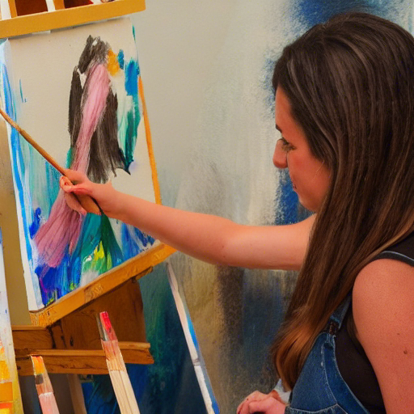
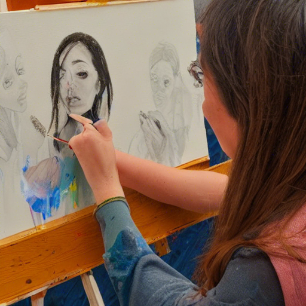
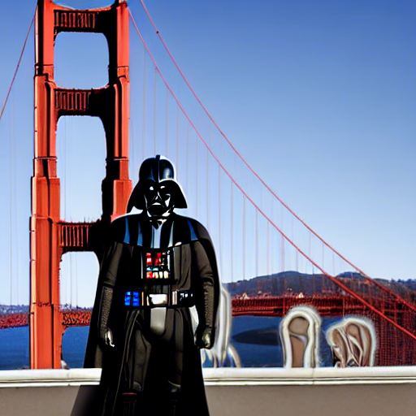

Stable Diffusion v1.5 setup on a Radeon Pro VII (AMD GPU)
=========================================================

> N.B.: the following note is based on archival notes documenting steps that, at the original time of writing (~2022), produced a stably-running Stable Diffusion configuration for Radeon Pro VII.
>       The original setup used: ROCm 5.3, Python 3.8, PyTorch 1.13, Ubuntu 20.04, and Linux kernel 6.0.3-060003-generic.
>       Since then, the ML ecosystem has continued to evolve rapidly and the original notes naturally aged like milk.
>       The current notes, lightly updated in 2026, make some attempt to fix the outdated parts, though these too may break over time.
>       In general the notes should be seen as suggestive, as they are not actively maintained.
>       Please consult official [ROCm compatibility documentation](https://rocm.docs.amd.com/en/latest/compatibility/compatibility-matrix.html#past-rocm-compatibility-matrix) for info on supported configurations.

These are personal notes cataloging steps that were needed to get [Stable Diffusion v1.5](https://huggingface.co/stable-diffusion-v1-5/stable-diffusion-v1-5) running locally on a Radeon Pro VII (AMD GPU).
The notes cover roughly 4 steps:
  * [Upgrade Ubuntu](#upgrade-ubuntu) (to ROCm-supported version)
  * [Upgrade Linux kernel](#upgrade-linux-kernel) (for compatibility with the AMD GPU)
  * [Install ROCm](#install-rocm)
  * [Download Stable Diffusion and set up Python environment](#download-stable-diffusion-and-set-up-python-environment)

Only some of these may be needed, depending on the system's starting configuration.

After these are a few sections covering miscellaneous tips, and comparisons of images generated using different model weights:
  * [Stable Diffusion tips](#stable-diffusion-tips)
  * [Image comparisons](#image-comparisons)
    * [EMA-only vs. EMA & non-EMA weights](#ema-only-vs-ema--non-ema-weights)
    * [Stable Diffusion v1.4 vs. v1.5](#stable-diffusion-v14-vs-v15)

Contents of this repository are as follows:
  * [README.md](README.md): notes for setting up and running Stable Diffusion locally on Radeon Pro VII (an AMD GPU)
  * [requirements.txt](requirements.txt): ROCm 6.3 / Python 3.11 / PyTorch 2.7 environment used in a 2026 setup


Upgrade Ubuntu
--------------

My starting point was Ubuntu v18.04, which required to first upgrade Ubuntu to a ROCm-supported version (see the historical [ROCm compatibility matrix](https://rocm.docs.amd.com/en/latest/compatibility/compatibility-matrix.html#past-versions-of-rocm-compatibility-matrix)), prior to installing ROCm.
Running these commands completed a full system update:
```bash
$ sudo apt update
$ sudo apt upgrade
$ sudo apt dist-upgrade
```

and removed unneeded packages:
```
$ sudo apt autoremove
```

which allowed to upgrade from Ubuntu v18.04 to a ROCm-supported version, with the following:
```bash
$ sudo do-release-upgrade -f DistUpgradeViewGtk3
```

This downloads an upgrade release tool; follow prompts from the installer to complete installation.


Upgrade Linux kernel
--------------------

Different AMD GPUs may require a different Linux kernel than what is installed on your system.
E.g., if ROCm is installed and you run `rocminfo` with an incompatible Linux kernel version, an error such as the following can occur:
```
HSA Error:  Incompatible kernel and userspace, AMD Radeon (TM) Pro VII disabled. Upgrade amdgpu.
```

This suggests that the Linux kernel should be upgraded.
E.g., Linux kernel version `Linux 5.4.0-131-generic` (my original starting point), was incompatible with Radeon Pro VII GPU, and needed to be upgraded to something that is compatible.
For the current ROCm 6.3 setup, Ubuntu 22.04.5 with Linux kernel version 5.15 is a supported operating system and kernel combination.
The setup used while updating these notes reported:

```bash
$ uname -r
5.15.0-179-generic
```


Install ROCm
------------

The current notes target ROCm 6.3; one method of installation is via the [AMDGPU installer](https://rocm.docs.amd.com/projects/install-on-linux/en/docs-6.3.0/install/amdgpu-install.html).
After following the instructions therein, a light smoketest of the installation is to run `rocminfo` which should show output similar to below:
```
==========
HSA Agents
==========
*******
Agent 1
*******
  Name:                    AMD Ryzen Threadripper 3960X 24-Core Processor
  Uuid:                    CPU-XX
  Marketing Name:          AMD Ryzen Threadripper 3960X 24-Core Processor
  Vendor Name:             CPU

⋮

*******
Agent 2
*******
  Name:                    gfx906
  Uuid:                    GPU-XX
  Marketing Name:          AMD Radeon (TM) Pro VII
  Vendor Name:             AMD
```

`rocm-smi` also can show some information about the GPU:
```
======================= ROCm System Management Interface =======================
================================= Concise Info =================================
GPU  Temp   AvgPwr  SCLK    MCLK    Fan    Perf  PwrCap  VRAM%  GPU%
0    49.0c  25.0W   860Mhz  350Mhz  9.41%  auto  190.0W    2%   0%
================================================================================
============================= End of ROCm SMI Log ==============================
```


Download Stable Diffusion and set up Python environment
------------------------------------------------------

With a compatible Ubuntu, Linux kernel, and ROCm installed, one can proceed to environment setup and Stable Diffusion download.

For setting up the Python environment needed to run Stable Diffusion locally, I used [Conda](https://anaconda.org/anaconda/python) (via [Miniconda](https://docs.conda.io/en/latest/miniconda.html)).
Once Conda is installed, the Python environment can be setup.
This repository provides a [requirements.txt](requirements.txt) targeting ROCm 6.3 / Python 3.11 / PyTorch 2.7 that I used in a 2026 setup for running locally on Radeon Pro VII (AMD GPU).
Set up can proceed as follows:
```bash
$ conda create --name ldm python=3.11
$ conda activate ldm
$ python -m pip install --upgrade pip

# requirements.txt is the one provided in this repository
$ python -m pip install -r requirements.txt
```

If the ROCm and PyTorch installations all went OK, PyTorch should be able to see the GPU, which can be checked from within Python:
```python
>>> import torch
>>> torch.cuda.is_available()
True
```

`torch.cuda.is_available()` should return `True` as above; but if it gives `False` it is possible the user needs to be added to `render` and `video` groups:
```bash
$ sudo usermod -a -G render,video $LOGNAME
```
Logging out then back in and checking `groups` should confirm the user is part of the `render` and `video` groups.

Once the environment is setup, clone the [Stable Diffusion repository](https://github.com/CompVis/stable-diffusion):
```bash
$ git clone https://github.com/CompVis/stable-diffusion.git
$ cd stable-diffusion
```

Stable Diffusion model weights can be downloaded from Hugging Face:
  * [v1-5-pruned-emaonly.ckpt](https://huggingface.co/stable-diffusion-v1-5/stable-diffusion-v1-5/blob/main/v1-5-pruned-emaonly.ckpt)

You can observe at Hugging Face there are two choices for the weights:
  * [v1-5-pruned-emaonly.ckpt](https://huggingface.co/stable-diffusion-v1-5/stable-diffusion-v1-5/blob/main/v1-5-pruned-emaonly.ckpt)
  * [v1-5-pruned.ckpt](https://huggingface.co/stable-diffusion-v1-5/stable-diffusion-v1-5/blob/main/v1-5-pruned.ckpt)

The 'emaonly' weights take less memory and are suitable for inference ('EMA' refers to 'exponential moving average' technique, a performance optimization for stochastic gradient descent; you can read more about it in the [original 'Adam' paper](https://arxiv.org/pdf/1412.6980.pdf)).
If interested in fine-tuning the model, v1-5-pruned.ckpt is suitable, which contains both EMA & non-EMA weights.
Out of curiosity, I compared images generated with both sets of weights, but couldn't discern a difference in quality; details could differ, but prompts seem to be captured about equally well using either of the weights. A representative comparison is shown [further below](#image-comparisons).


Stable Diffusion tips
---------------------

  * There are different possibiliites for image generation, described in detail at the [Stable Diffusion official repository](https://github.com/CompVis/stable-diffusion/tree/main):
    * [Text-to-image](https://github.com/CompVis/stable-diffusion/tree/main?tab=readme-ov-file#text-to-image-with-stable-diffusion): generates an image from an input text prompt.
    * [Image modification](https://github.com/CompVis/stable-diffusion/tree/main?tab=readme-ov-file#image-modification-with-stable-diffusion): generates an image from a user-provided image, a text prompt, and a parameter controlling the amount of noise added to the user-provided image.
    * [Inpainting](https://huggingface.co/stable-diffusion-v1-5/stable-diffusion-inpainting): generates an image from a user-provided image, an image mask, and a text prompt.
      * This requires to download the inpainting weights: [sd-v1-5-inpainting.ckpt](https://huggingface.co/stable-diffusion-v1-5/stable-diffusion-inpainting/blob/main/sd-v1-5-inpainting.ckpt).
  * Image modification seems to work best with images of size 512 x 512 pixels.


Image comparisons
-----------------

These are some comparisons between images generated using the text-to-image capability, with different choices for Stable Diffusion model weights.
The comparisons are [EMA-only vs. EMA & non-EMA weights](#ema-only-vs-ema--non-ema-weights) (both v1.5), and [v1.4 vs. v1.5 weights](#stable-diffusion-v14-vs-v15) (both EMA-only);
these are 'anecdotal,' hand-selected comparisons, so none of this should be taken as a rigorous statement about the result of using different weights.
Still, some of the comparisons are interesting.


### EMA-only vs. EMA & non-EMA weights

The images below were generated using the following prompt, with EMA-only, as well EMA & non-EMA weights (left and right, respectively); both sets of weights are v1.5.
The image below is just a single case, but representative of the kind of similarities and differences I've seen.
Images were of similar quality, whether using the EMA-only or EMA & non-EMA weights.
(The command below was lightly updated in 2026 for compatibility.)
```bash
# for non-EMA, instead use: --ckpt /PATH/TO/MODEL/WEIGHTS/v1-5-pruned.ckpt
$ PYTHONPATH=. TORCH_FORCE_NO_WEIGHTS_ONLY_LOAD=1 \
    python scripts/txt2img.py \
    --ckpt /PATH/TO/MODEL/WEIGHTS/v1-5-pruned-emaonly.ckpt \
    --prompt "80s style floating-head family portrait of cute scottish fold cats, in starcraft 2 space, Canon EOS R3, 80mm" \
    --plms
```
v1.5, EMA-only ([v1-5-pruned-emaonly.ckpt](https://huggingface.co/stable-diffusion-v1-5/stable-diffusion-v1-5/blob/main/v1-5-pruned-emaonly.ckpt)) | v1.5, EMA & non-EMA ([v1-5-pruned.ckpt](https://huggingface.co/stable-diffusion-v1-5/stable-diffusion-v1-5/blob/main/v1-5-pruned.ckpt))
:----------------------------------------------:|:-----------------------------------------:
  |  


### Stable Diffusion v1.4 vs. v1.5

The following three prompts (corresponding to the following three rows of images, respectively) were used to generate the images below, using v1.4 or v1.5 weights (left and right columns, respectively); both sets of weights are EMA-only.
In testing, the v1.5 weights tended to capture the input prompts more closely than v1.4 weights, which is probably expected.
On average, the images generated using v1.4 weights seemed to have stronger artifacts, as compared with v1.5.
(The command belows were lightly updated in 2026 for compatibility.)
```bash
# for v1.4, instead use: --ckpt /PATH/TO/MODEL/WEIGHTS/sd-v1-4.ckpt
$ PYTHONPATH=. TORCH_FORCE_NO_WEIGHTS_ONLY_LOAD=1 \
    python scripts/txt2img.py \
    --ckpt /PATH/TO/MODEL/WEIGHTS/v1-5-pruned-emaonly.ckpt \
    --prompt "Painting of a person painting a person painting a person" \
    --plms
$ PYTHONPATH=. TORCH_FORCE_NO_WEIGHTS_ONLY_LOAD=1 \
    python scripts/txt2img.py \
    --ckpt /PATH/TO/MODEL/WEIGHTS/v1-5-pruned-emaonly.ckpt \
    --prompt "High quality photo of Darth Vader at the Golden Gate Bridge" \
    --plms
$ PYTHONPATH=. TORCH_FORCE_NO_WEIGHTS_ONLY_LOAD=1 \
    python scripts/txt2img.py \
    --ckpt /PATH/TO/MODEL/WEIGHTS/v1-5-pruned-emaonly.ckpt \
    --prompt "80s style floating-head family portrait of cute scottish fold cats, fantasy scifi space background, vintage 80s camera, 35mm" \
    --plms
```
v1.4, EMA-only ([sd-v1-4.ckpt](https://huggingface.co/CompVis/stable-diffusion-v-1-4-original/blob/main/sd-v1-4.ckpt)) | v1.5, EMA-only ([v1-5-pruned-emaonly.ckpt](https://huggingface.co/stable-diffusion-v1-5/stable-diffusion-v1-5/blob/main/v1-5-pruned-emaonly.ckpt))
:-----------------------------------------:|:-----------------------------------------:
  |  
  |  
  |  


References
----------
  * [Radeon Pro VII](https://www.techpowerup.com/gpu-specs/radeon-pro-vii.c3575)
  * [ROCm compatibility matrix](https://rocm.docs.amd.com/en/latest/compatibility/compatibility-matrix.html#past-rocm-compatibility-matrix)
  * [How to upgrade from Ubuntu v18.04 to v20.04](https://ubuntu.com/blog/how-to-upgrade-from-ubuntu-18-04-lts-to-20-04-lts-today)
  * [Miniconda](https://docs.conda.io/en/latest/miniconda.html)
  * [PyTorch](https://pytorch.org/)
  * [How to add user to video group](https://askubuntu.com/questions/881985/how-do-i-add-myself-to-the-video-group-after-installing-amdgpu-pro-driver)
  * [Stable Diffusion GitHub repository](https://github.com/CompVis/stable-diffusion/tree/main)
  * [Stable Diffusion v1.5](https://huggingface.co/stable-diffusion-v1-5/stable-diffusion-v1-5)
  * [Stable Diffusion inpainting](https://huggingface.co/stable-diffusion-v1-5/stable-diffusion-inpainting)
  * [Stable Diffusion v1.4](https://huggingface.co/CompVis/stable-diffusion-v-1-4-original)
